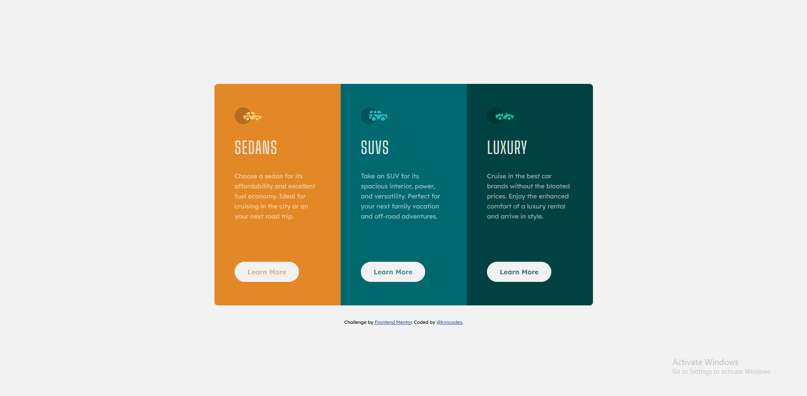

# Frontend Mentor - 3-column preview card component

This is a solution to the [3-column preview card component challenge on Frontend Mentor](https://www.frontendmentor.io/challenges/3column-preview-card-component-pH92eAR2-). Frontend Mentor challenges help you improve your coding skills by building realistic projects.

## Welcome! 👋

Thanks for checking out this front-end coding challenge.

[Frontend Mentor](https://www.frontendmentor.io) challenges help you improve your coding skills by building realistic projects.

**To do this challenge, you need a basic understanding of HTML and CSS.**

## The challenge

Your challenge is to build out this 3-column preview card component and get it looking as close to the design as possible.

You can use any tools you like to help you complete the challenge. So if you've got something you'd like to practice, feel free to give it a go.

Your users should be able to:

-   View the optimal layout depending on their device's screen size
-   See hover states for interactive elements

Want some support on the challenge? [Join our community](https://www.frontendmentor.io/community) and ask questions in the **#help** channel.

## Table of contents

-   [Overview](#overview)
    -   [The challenge](#the-challenge)
    -   [Screenshot](#screenshot)
    -   [Links](#links)
-   [My process](#my-process)
    -   [Built with](#built-with)
    -   [What I learned](#what-i-learned)
    -   [Continued development](#continued-development)
    -   [Useful resources](#useful-resources)
-   [Author](#author)
-   [Acknowledgments](#acknowledgments)

### Screenshot

### Links

-   Solution URL: [SolutionURL](https://www.frontendmentor.io/solutions/3-column-product-component-LPKCbZhNdG)
-   Live Site URL: [SiteURL](https://frontend-mentor-3column-product.netlify.app/)

### Built with

-   Semantic HTML5 markup
-   CSS custom properties
-   Flexbox
-   CSS Grid
-   Mobile-first workflow
